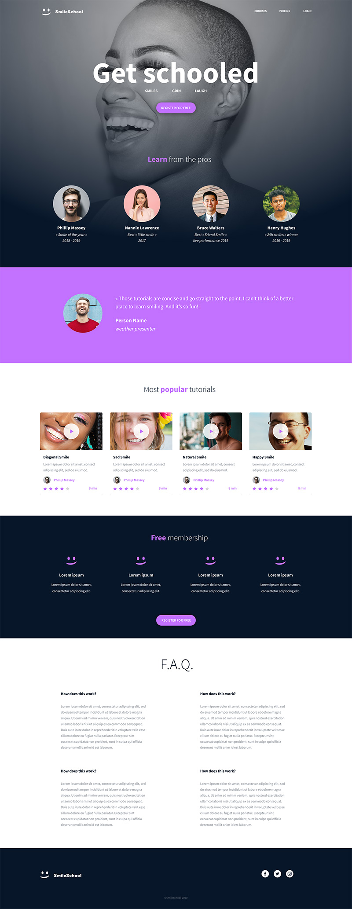
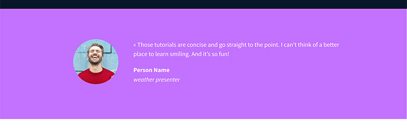
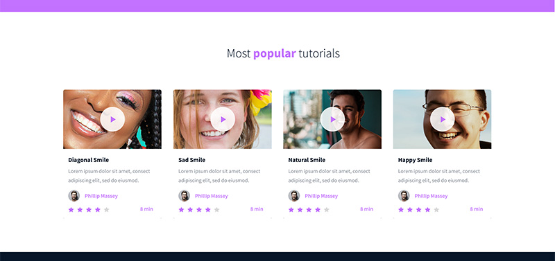
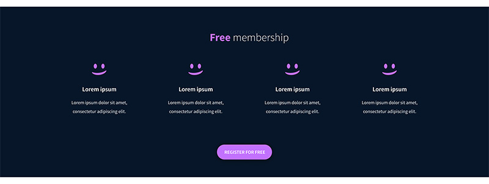
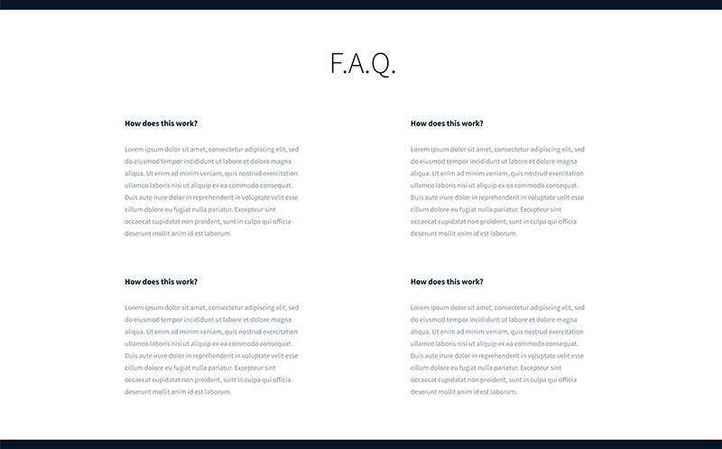

# SmileCar: Styling a Designer's Page from Scratch

This is the second half of an advanced front end project at ALU. In the first half I built the
page structure in pure HTML with no styling at all. Here I take that same markup and write the
CSS that turns it into the finished design.

Nothing in the HTML changes shape. The tree I built earlier is exactly the tree I style now,
which is the whole reason the first project insisted on getting the nesting right before anyone
was allowed to think about colour.

## The target



The page is a car enthusiast site: a hero banner over a photograph, a row of marque cards, a
testimonial, a grid of video reviews, a membership block, an FAQ, and a footer.

## What I am building, section by section


The banner sits on a full bleed background photograph with a dark overlay. The header floats on
top of it rather than above it, the navigation sits right, and everything in the hero is centred
on a container that stops well short of the viewport edges.



A purple band with a circular portrait on the left and the quote to its right.



Four cards in a row on white, each with a rounded thumbnail, a play icon centred over it, an
author line and a star rating.



Back to the dark background, four icon blocks, and a rounded button.



A two by two grid of question and answer blocks on white.


Logo left, social icons right, copyright centred underneath.

## Running it

No build step, no server, no dependencies.

```
open index.html
```

Or just double click the file.

## Project structure

```
css_advanced/
    README.md
    index.html
    styles.css
    images/
```

`index.html` is copied unchanged from the HTML project apart from two additions: the stylesheet
link, and a `<span>` around one word in two of the section titles so a single word can be
coloured differently from the rest of the heading.

## Concepts this project is really about

**The cascade.** When two rules could apply to the same element, the later one wins, but only if
they have equal specificity. Order settles ties. It does not override a more specific selector.

**Specificity.** A selector scores by what it is made of: an id beats a class, a class beats a
tag. `header a` beats a bare `a` no matter which one is written first in the file. Most confusing
CSS bugs are really specificity surprises, not typos.

**The box model.** Every element is content, then padding, then border, then margin. By default
`width` describes the content only, so padding and border are added on top and the element ends
up wider than the number you wrote. Setting `box-sizing: border-box` makes `width` mean the whole
visible box, which is usually what you actually wanted.

**Flexbox for one dimensional layout.** A flex container lays its children along one axis.
`flex-direction` picks the axis, `justify-content` distributes along it, `align-items` aligns
across it. Four cards in a row, a logo pushed left and links pushed right, a star rating with
duration at the far end: all the same tool.

**Centring a container.** A block element with a set width and `margin: 0 auto` splits the
leftover space evenly on both sides. That is how every section here stops short of the viewport
edge and sits in the middle.

**Reusing rules instead of repeating them.** The purple appears in five separate places, the
rounded button twice, the circular image three times. Writing those once and applying them by
selector is the difference between a stylesheet you can change and one you have to rewrite.

## Requirements

* Every file ends with a newline
* No external libraries. Plain HTML and CSS only. No Bootstrap, no frameworks
* All code passes the [W3C Validator](https://validator.w3.org/) and the
  [W3C CSS Validator](https://jigsaw.w3.org/css-validator/)
* All colours, sizes, spacing and images come from the Figma design file

## Author

Mwiseneza Cyubahiro Clovis, ALU Front End Web Development.

Design file provided by the course on Figma.
